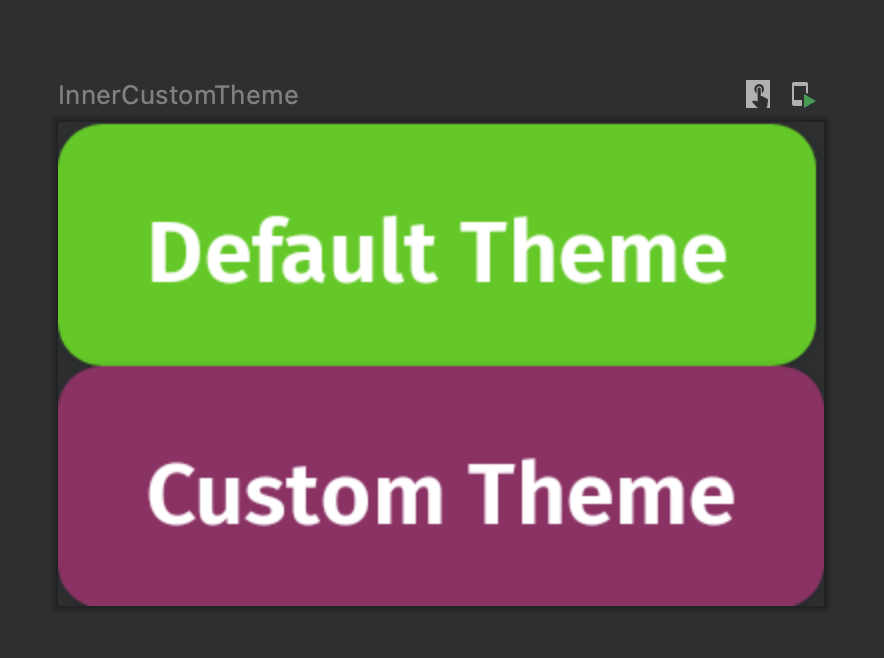

# 🚀 design-system-android
Everli Design System library for Android 


## 🎨 Design System

Here you'll find how to use the library and code samples.
For a more detailed look on implementation decisions and how the library was built, have a look [here](https://s24srl.atlassian.net/wiki/spaces/TECH/pages/2252963941/Android)

## Compose vs View/XML

The library is first built using **Jetpack Compose** but it does offer a bridge to use it in **XML**. Just note that Compose is the ***first class citizen*** of the library, there are some limitation when it comes to XML.

## How to use it


Locally via **Gradle** 

`implementation project(path: ':designsystem')`

Remote via **Gradle** 


*Remote support via private repository to be added soon*

## Atoms

Atoms are standalone constants that can be used anywhere and exist outside a Theme.

### 🎨 Colors

Standalone colors are plain constants that be used anywhere.

#### Compose

All colors are Compose `Color` accessible via the `EverliColors` object:

```kotlin
@Composable
fun SomeText() {
  Text(
    text = "Hello",
    color = EverliColors.Black100,
  )
}
```

#### XML

All colors are normal resources stored in `colors.xml`

```xml
<TextView
    android:layout_width="wrap_content"
    android:layout_height="wrap_content"
    android:text="Hello"
    android:textColor="@color/black_100" />
```

### 🔤 Typography

#### Compose

All styles are Compose `TextStyle` stored in `EverliTypography` object:


```kotlin
@Composable
fun SomeText() {
  Text(
    text = "Hello",
    color = EverliColors.Black100,
    style = EverliTypography.Body.Regular
  )
}
```

#### XML

The styles are stored as xml `styles` in `styles.xml`:


```xml
<TextView
    style="@style/Typography.Body.Regular"
    android:layout_width="wrap_content"
    android:layout_height="wrap_content"
    android:text="Hello"
    android:textColor="@color/black_100" />
```

**Note**: All styles are accessible via the `Typography` prefix.

### 🟢 Icons

Icons are defined as `vector drawables` in `/drawable`.

**Note**: All icons by default are `24x24` and have a tint of `Black100` (#302030), you can change the based on the context (using Compose modifiers or xml attributes).

#### Compose

All icons are `Painter` types, accessible via `EverliIcons`

```kotlin
Icon(painter = EverliIcons.Menu)
```

To change the color and size in the context of an `Icon`:

```kotlin
Icon(
    painter = EverliIcons.ActionMore,
    contentDescription = "action more",
    tint = EverliColors.Green100, // change color
    modifier = Modifier // change size
        .width(64.dp)
        .height(64.dp))
```

All icons are also accessible directly via `R.drawable` as usual.

#### XML

Icons are used normally from `/drawable` inside xml or `R.drawable` in code.

```xml
<ImageView
    android:layout_width="wrap_content"
    android:layout_height="wrap_content"
    android:background="@drawable/ico_menu" />
```

To change color and size in the context of an `ImageView`:

```xml
<ImageView
    android:layout_width="64dp"
    android:layout_height="64dp"
    android:background="@drawable/ico_menu"
    android:backgroundTint="@color/green_100" />
```

## 🌗 Theme

The theme is defined by a quite complex but not really token structure.

A token is a key-value pair that describes a specific characteristic in the design system. 

**Example:**

`button.color.primary.background.enabled = Green100`

These are mostly used inside the design system when developing components BUT can also be changed by client apps as part of custom theme, allowing very **granular** changes in the theme.

By default the design system comes with a `DefaultTheme` to be used right away, but there is the possibility to customize each token in client apps.

#### Compose

You need to define a `EverliTheme` as the root of your composition tree or use the `DefaultTheme`

```kotlin
@Composable
fun EverliApp() {
    DefaultTheme() {
        // your app
    }
}
```

Then inside any `@Composable` you will have access to any token of the design system via the `EverliTheme` object

```kotlin
@Composable
fun SomeRandomComponent() {
    Text(
        text = "label",
        style = EverliTheme.typography.subtitleSemibold))
}
```

**Note**: Most *(if not all)* components provided in the library, require you to have a defined `EverliTheme` to work properly.

##### Custom Theme

If you want to provide a custom implementation, you can just copy `DefaultTheme` components or implement your own `EverliTheme`


##### Copy Default Theme

```kotlin
val SupplyButtonTheme = DefaultButtonTheme.copy(
  color = DefaultButtonTheme.color.copy(
    primary = ButtonColors(
      background = StateColor(
        enabled = EverliColors.Violet100,
        disabled = EverliColors.Gray15,
      ),
      text = StateColor(
        enabled = EverliColors.White,
        disabled = EverliColors.Gray100,
      )
    )
  ))

@Composable
fun AppWithCustomTheme() {
  EverliTheme(
    typography = DefaultTypography,
    radius = DefaultRadius,
    dimensions = DefaultDimensions,
    buttonTheme = SupplyButtonTheme,
  ) {
    // your content
  }
}
```

In the above example, we define a custom theme just for the `Button`. Note that all components of the Theme have dedicated data classes and are easily customizable via kotlin's `.copy` method as shown above.

##### Nesting Themes

Another nice advantage of `Compose` is that we can nest multiple themes in the same app:

```kotlin
@Preview
@Composable
fun InnerCustomTheme() {
  DefaultTheme {
    Column {
      // Default Theme
      EverliButton(onClick = { /*TODO*/ }, text = "Default Theme")

      // Inner custom theme
      EverliTheme(
        buttonTheme = SupplyButtonTheme,
      ) {
        EverliButton(onClick = { /*TODO*/ }, text = "Custom Theme")
      }
    }
  }
}
```




Notice that the second button used a different theme just for the button, all other tokens are inherited by the parent theme. Again, all this is possible thanks to `CompositionLocalProviders`

This can be useful if you want a particular section of the app to use a different theme (e.g. debug area).


#### XML

There are some limitations when it comes to `XML` and theming, it's not as flexible as the `Compose`. 

By default the design system creates a `EverliTheme` that extends one of `Material`:

```xml
<style name="EverliTheme" parent="Theme.MaterialComponents.Light.NoActionBar">
```

All tokens are available in the theme **apart from** text styles. This is a limitation. That's because behind the scenes we create a `Compose` theme based on the `XML` one, but currently there is no nice way to map `XML` text styles to `Compose` ones.

There are some workarounds for that if needed. But currently most of the times you would only change the colors.

**Customizing colors and dimensions:**

```xml
  <style name="Theme.Supply" parent="EverliTheme">
    <!-- Material specific -->
    <item name="colorPrimary">@color/purple_500</item>
    <item name="colorPrimaryVariant">@color/purple_700</item>
    <item name="colorOnPrimary">@color/white</item>

    <!-- Design system specific -->
    <item name="buttonColorPrimaryBackgroundEnabled">@color/violet_100</item>
    <item name="buttonSizeSmall">20dp</item>
  </style>
```

These tokens are then used by all `XML` compatible components such as the `EverliButtonView`, more about that in the components section.
